# 个人平台前端页面

MTCS (MultiTech Creative System) 使用vue3+vite+router-pinia-[arco-design](https://arco.design/)+[v-md-editor](https://code-farmer-i.github.io/vue-markdown-editor/zh/)等等组件组件进行编写。

> 开发日志: [前端开发日志](https://iakbbhkfqkz.feishu.cn/wiki/GjTbwTDCBiPtfqkC9uCcIWDEnkj?from=from_copylink)

## 实现功能
- [x] 登录
- [x] 注册
- [x] 首页展示
- [x] 可以根据不同角色用户展示不同的菜单
- [x] 增加瑞银router后可以自动增加对应的菜单（可以自己配置是否展示出来）
- [x] 所有接口信息展示和接口详细展示页面
- [x] 普通用户对自己接口进行增删改查页面
- [x] 普通用户和对自己接口进行上下线操作页面
- [x] 管理员对所有接口进行增删改查操作页面
- [x] 管理员审核所有接口页面
- [x] gpt聊天页面，可以增加对应的prompt

## 页面展示

### 登录页面
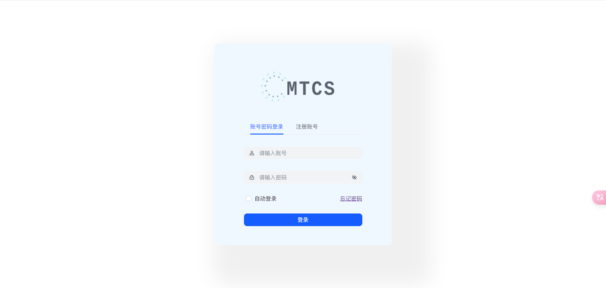
### 首页展示页面
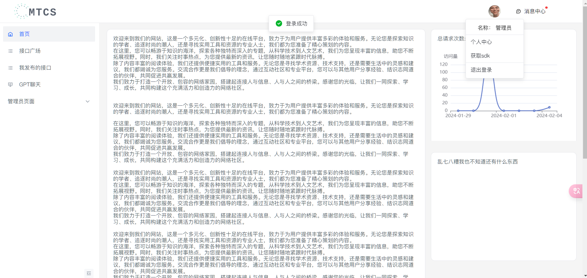
### 用户信息展示页面
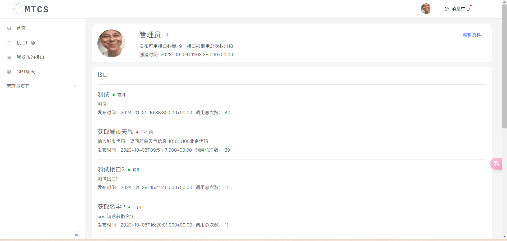
### 编辑资料页面
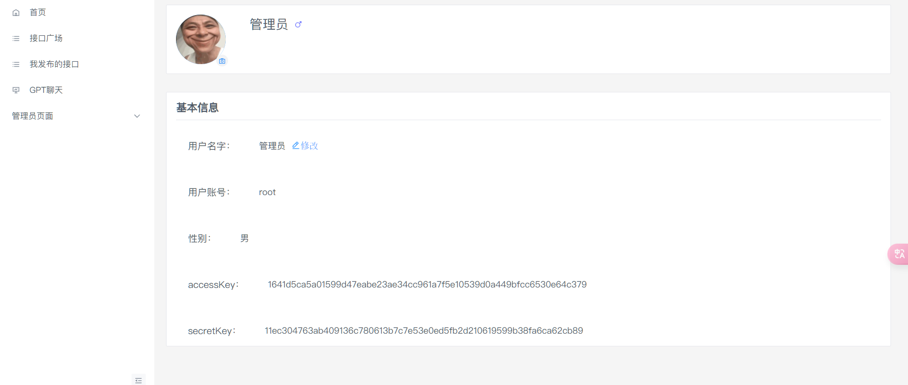
### 接口广场页面
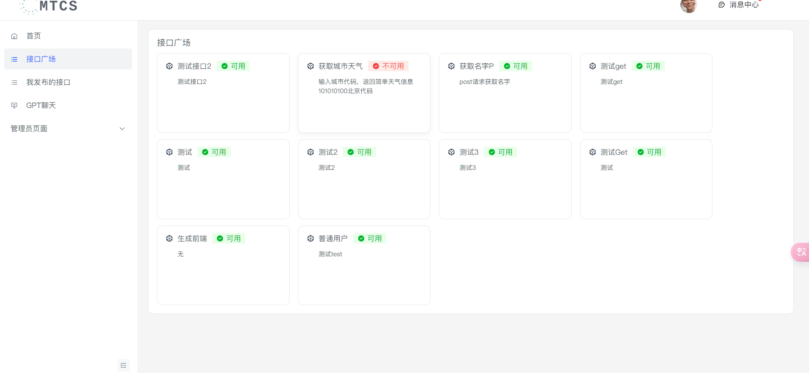
### 接口详细页面
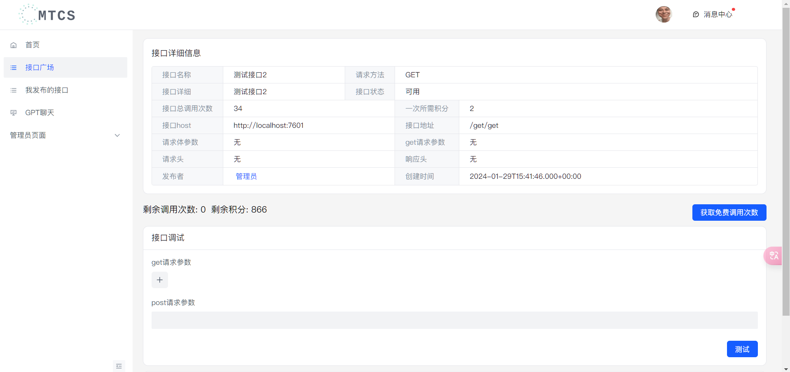
### 我发布的接口页面
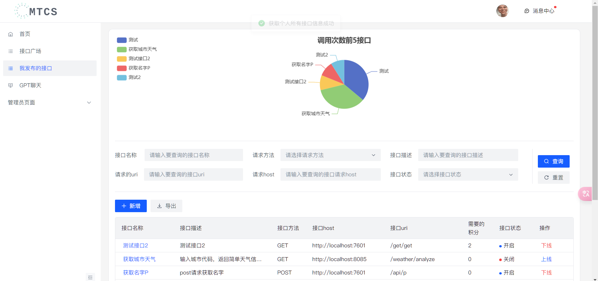
#### 详细
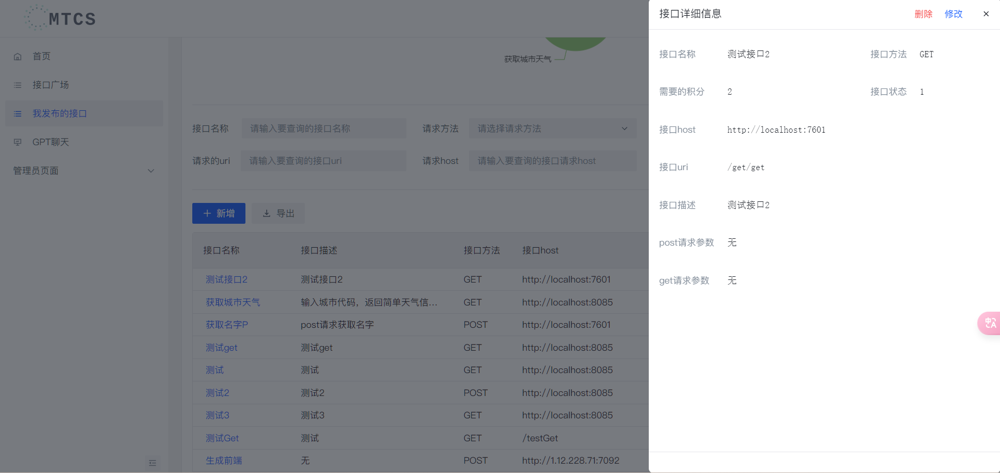
#### 新增
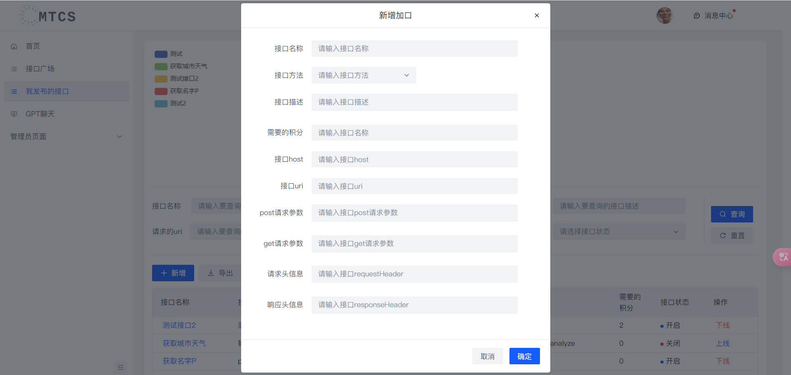

### gpt页面
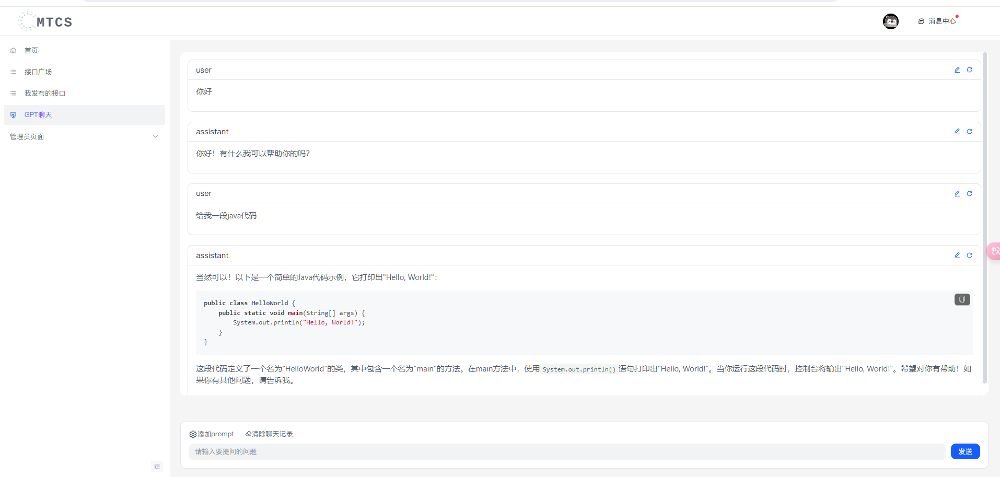

### 审核页面
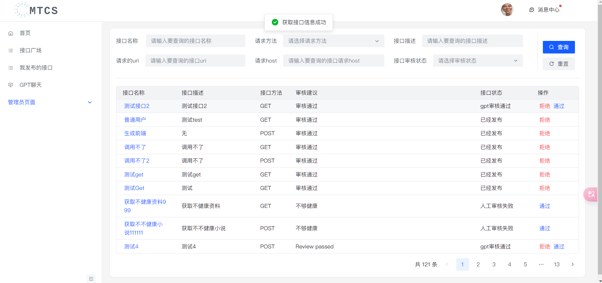

